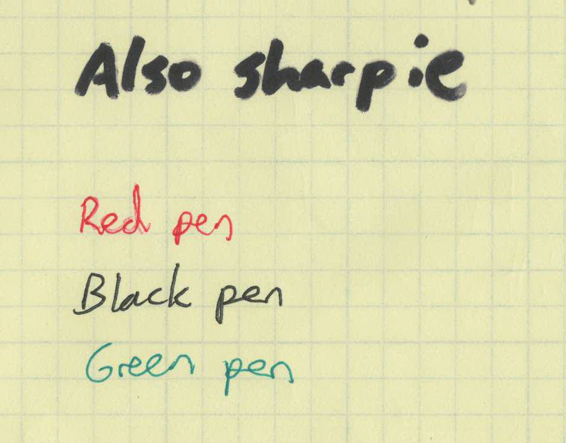
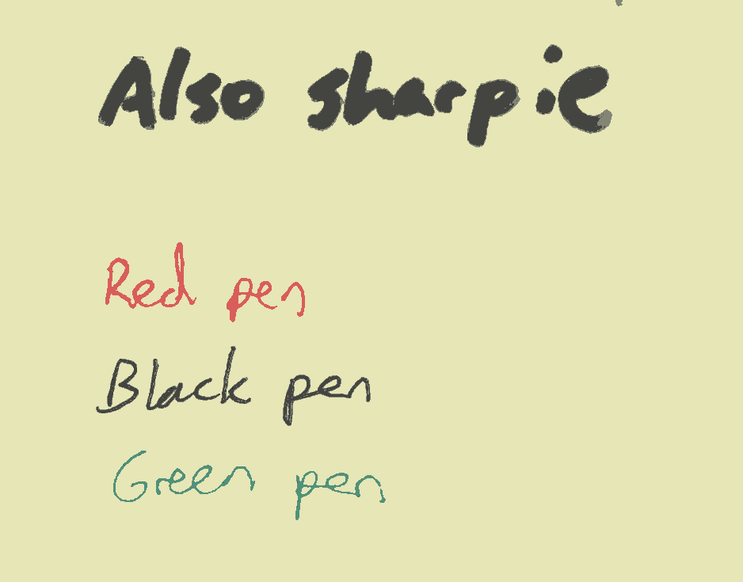

# noteshrink

Convert scans of handwritten notes to beautiful.

## Requirements

 - [stb](https://github.com/nothings/stb). Copy to `src/ext`.

## Usage

```shell
./noteshrink IMAGE_IN IMAGE_OUT.png
```

## Build

```shell
mkdir build
cd build
cmake ..
make
```

## Demo

```shell
./noteshrink ../images/test.jpg ../images/testout.png
Palette:
0: #e6e6b6
1: #e78178
2: #838575
3: #4f927a
4: #444541
5: #d44e4f
Save png: ../images/testout.png
done
```
```shell
optipng -q ../images/testout.png
```

`images/test.jpg`:  

**35113** bytes.

`images/testout.png`:  

**7281** bytes.

See all imageset: [noteshrink-demo](https://github.com/ImageProcessing-ElectronicPublications/noteshrink-demo).
